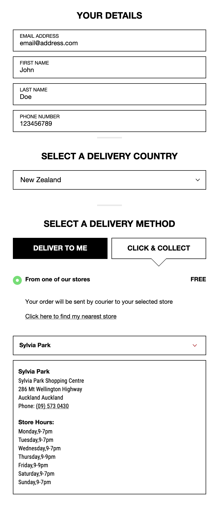
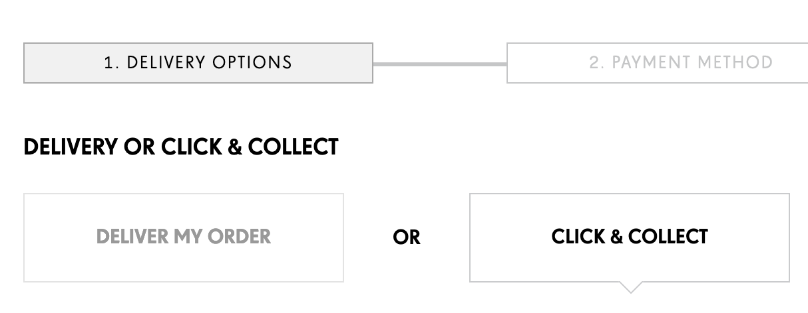
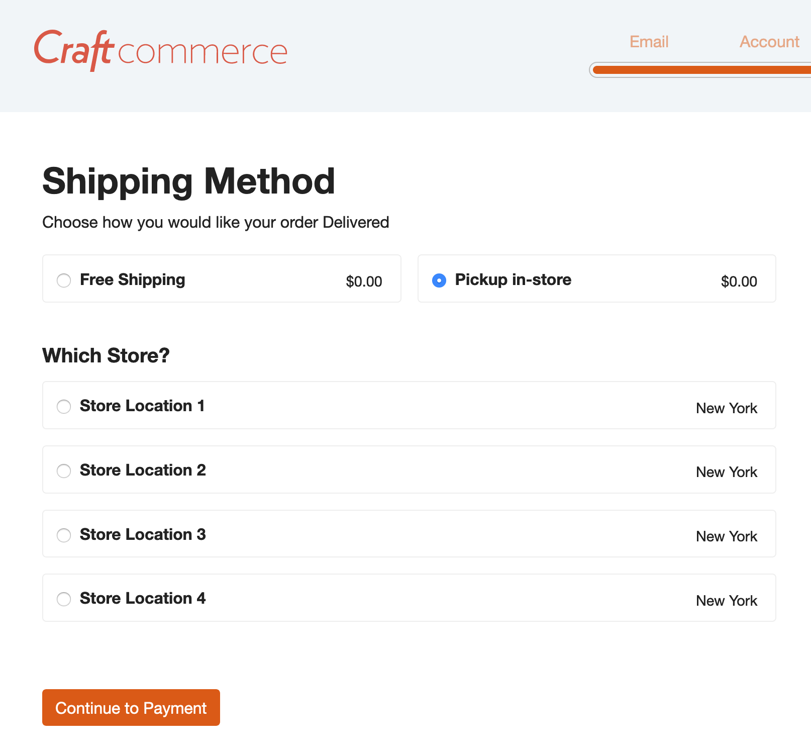
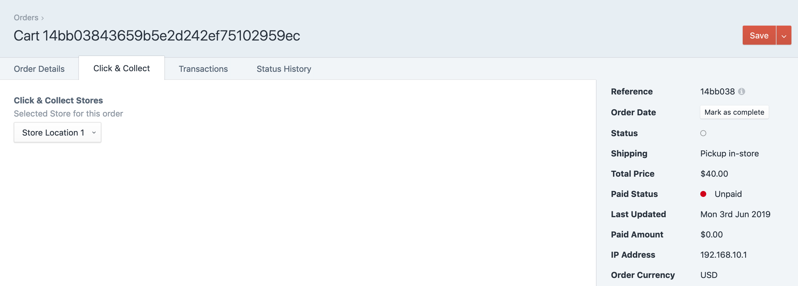
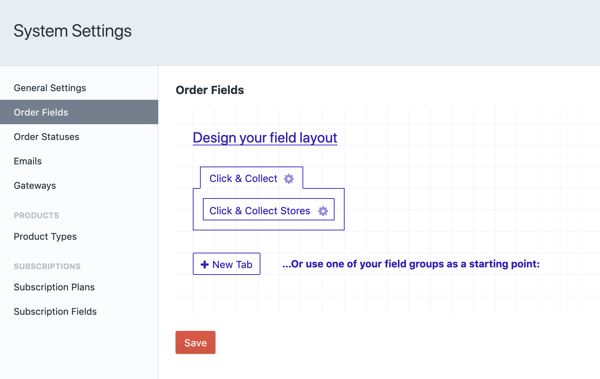
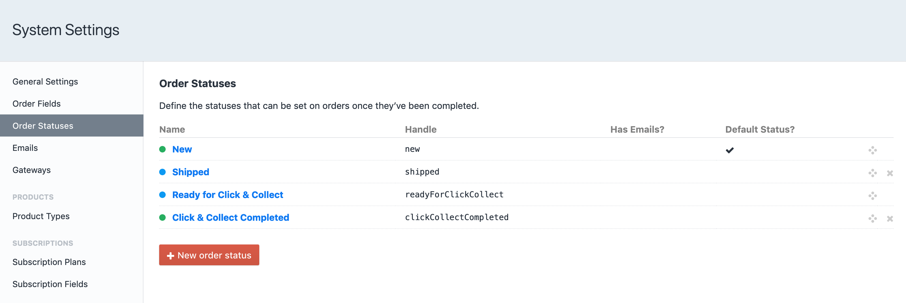
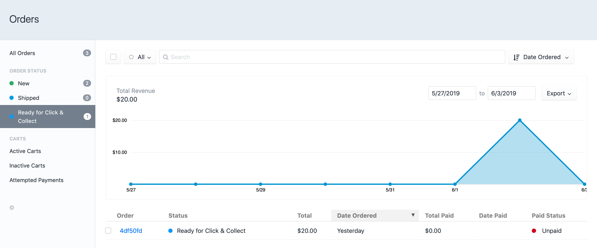
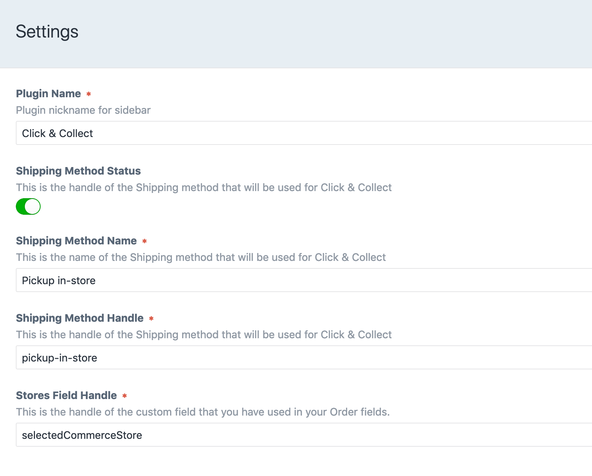

<p align="center"></p>

# Click And Collect plugin for Craft Commerce 2

Click & Collect for Craft Commerce allows you to quickly start allowing your customers
to pick their orders up in store rather than their items being shipped to them.

This can save businesses courier/shipping costs, get products to customers faster and provider a better service.

This plugin will allow you to manage and create multiple store locations in which the customer can select from. IT will be up to you to implement this logic on the frontend however you'll find some quickstart examples below.

Along with store management, this plugin will automatically create a Shipping method which can be renamed. This will be the method that customers choose if they wish to collect in store.

If a customer chooses to pick their order up in store, the plugin will update their order with the selected shipping mehtod and use a custom field to save their selected store.

## Installation

Either by the plugin store (search "Click And Collect") or via composer.

`"mediabeastnz/craft-commerce-click-and-collect": "^1.0.0"`

## Requirements

This plugin requires Craft CMS 3.0.0 or later and Craft Commerce 2.0 or later.

## Setup
As mentioned above, this plugin doesn't provide any frontend widgets only the necessary data in which you can use to implement any sort of checkout process.

Please use this process as a reference when first installing:

1. Once the plugin is installed navigate to the plugins settings screen and update any default settings.

2. Next you will need to create your cusatom order field. Create a new field using the `Click & Collect Stores` field and remember to set its handle as it is in the settings. 
    a. The handle needs to match the plugin setting `Stores Field Handle`.

3. Add your new field to the `Order Fields` under the Commerce System Settings.
    a. Note you can name the tab what ever suits. This field will only ever be used when the Orders Shipping Method is pickup in store (or whatever you called it).

4. Create a few Stores

5. Now all that's left is to update your frontend for your store to allow customers to select the new shipping method and stores.
    a. Below are some code examples to get you started as well screenshots of how other stores have implemented this feature.

## Examples / Recommendations

### List out all Stores
```twig
{# First query for all Stores | You could also filter this list if required #}

{# Get the storeFieldHandle as per your settings | This is what stores the selected store #}


    <div class="shipping-select">
        <label>
            <input type="radio" name="{{storeFieldHandle}}" value="{{ store.id }}" />
            <strong>{{ store.title }}</strong>
            <span class="price">{{ store.address.city }}</span> {# You have access to the full address model here #}
        </label>
    </div>

```

### Example of implementation
The examples below are screenshots of what is possible. A small amount of javascript and you'll be up and running in no time.
<details><summary>On the checkout page (step 1)</summary>
<p></p>
</details>
<details><summary>Delivery options (step 1)</summary>
<p></p>
</details>


### Plugin Screenshots
<details><summary>Basic frontend setup</summary>
<p></p>
</details>
<details><summary>Custom Field in an order/cart</summary>
<p></p>
</details>
<details><summary>Custom Field in the Order Fields</summary>
<p></p>
</details>
<details><summary>Custom Order Status</summary>
<p></p>
</details>
<details><summary>Custom Order Status - Dashboard</summary>
<p></p>
</details>
<details><summary>Plugin Settings</summary>
<p></p>
</details>

## Feature Requests
Feature requests are always welcome, if you have any ideas please either submit an issue here or contact me at [www.mylesderham.dev](www.mylesderham.dev).

## Roadmap
* Dashboard to see incoming pickup orders, stats on delivery vs pickup
* Better documentation on how to implement frontend
* Create a few Event hooks to allow other plugins to integrate